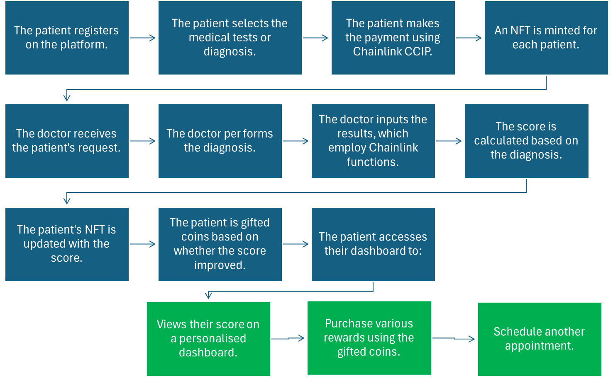

Medibyte 

*Unlock your health potential with Medibyte - where health meets innovation, revolutionise your well-being with Medibyte services* 🩺

Medibyte is a project that leverages the power of the Avalanche smart contract platform to reward users with onchain tokens that link to a unique dynamic NFT. The project attempts to promote healthy living choices by rewarding users with Medicoin tokens (transferable to USDC tokens) according to data held offchain health-related data. 

The project is accessible to users across the globe and ensures a data intensive process like searching and maintaining health records, a very easy task with its friendly user interface. You can see it live here: https://

*You should be met with a homepage that looks like this:*

**The project consists of the following repository:**
https://github.com/TeamMaverick5/Medibyte

**Motivation behind the project**

Medibyte was created to solve the issue of costs associated with medical facilities and the resulting temptation for people to succumb to unhealthy options because they are cheaper. We saw an opportunity to tokenise health statistics via a dynamic NFTs that also serve the purpose of handing back the ownership of medical records back to users. Our mission is to reward healthy alternatives and avoid healthcare congestion as a result of avoidable habits leading to adverse health conditions (think obesity, high blood pressure, smoking-related cancers). 

Coming from a variety of backgrounds and healthcare systems, the Medibyte Team decided on this project given the ability for health to transcend geographical boundaries and create a sense of community towards a common goal. As a globalised society, we also recognise that healthier options sometimes aren't as accessible as they should be (e.g. in some countries, soft drink is cheaper than water in stores). Our aim is to create a transparent reward system that brings the cost of healthier options, parallel to the cheaper unhealthy options.  

**How it works**

The project utilizes blockchain technology to incentivize patients based on their health records and improvements in their health. It involves a comprehensive system of dynamic NFTs and a native token, MediCoin. Here’s how it functions:

1.Patient Health Data and Test Selection:

->Patients can select health tests they wish to undergo using the selectTests function. This information is stored on-chain.
->Authorized doctors are notified via the TestsSelected event when a patient selects tests, allowing them to prepare and update the patient’s health data accordingly.

2.Dynamic NFTs:

->Each patient is associated with a unique PatientNFT, which dynamically updates based on their health records.
->When a doctor updates a patient’s health score using the updatePatientHealthScore function, the system fetches the health records and updates the NFT’s metadata.
->If the patient does not already have an NFT, one is minted for them upon their first health record update.

3.Incentives and Rewards:

->Patients earn MediCoin tokens as rewards for maintaining or improving their health scores.
->Patients can claim various reward NFTs (e.g., HealthInsuranceNFT, FreeHealthKitNFT, FreeHealthCheckupNFT) by meeting predefined MediCoin balance thresholds.
->Referral bonuses in MediCoin are provided to patients who refer new users to the system, promoting growth and engagement.

4.Doctor Authorization and Data Integrity:

Only authorized doctors can update patient health scores, ensuring the integrity and trustworthiness of the data.
The contract owner can manage the list of authorized doctors.

5.Secure Data Handling:

->The contract uses Chainlink’s FunctionsClient to securely fetch and handle external health data.
->The dynamic nature of the NFTs reflects real-time updates based on the patient’s health data.

6.Event-driven Architecture:

->Events such as TestsSelected, HealthScoreUpdated, and RewardClaimed provide transparency and allow external systems to respond to changes within the contract.
->By integrating dynamic NFTs, real-time data updates, and token-based incentives, the project aims to motivate patients to improve their health and engage with their health records in a meaningful way on the blockchain.

**Backend**

Found here: https://github.com/TeamMaverick5/Medibyte/tree/main/ipfs-api

The backend infrastructure is built with MongoDB and Node.js, noting that data is decentralised via the IPFS gateway. 

An offchain function was also used to save gas. As outlined above, Medibyte uses an offchain function to:
1. calculate the patient score; 
2. update the corresponding NFT held by a patient;
3. send an updated score alongside other attributes (e.g. number of Medicoins) to the user; 
4. simultaneously:
   a) return a URI to the Medibytes team to outline the amount of tokens to be issued to the patient
   b) return the URI of patient nft to the smart contract handling the core logic (Health_Contract).   

The above is made possible because once a patient initially registers, the API sets the NFT data which stores the unique URI where NFT data is stored on IPFS. 

**to calculate a patient score the deployed smart contracts are fetching data from the same API and applying our calculation logic on that data.*

**Frontend**

Found here: https://github.com/TeamMaverick5/Medibyte/tree/main/client

The frontend uses React and  Vite to provide a minimal setup to get React working in Vite with HMR and some ESLint rules. Together, these tools provide users with a minimalist and modern interface for frictionless interaction with the backend.

To also ensure seamless use of the Medibytes platform, the Medibytes team has also integrated Chainlink’s Cross-Chain Interoperability Protocol (CCIP) for patients to use other networks. This is made possible by the use of a receiver and sender contracts. Put simply, the receiver contract is deployed on the doctor's network and sender contract is deployed on the patient's network. What this practically means is that patients are able to easily pay for medical tests in USDC from their respective network or better yet, receive rewards directly to their connected wallet.  

**Summary**

When using Medibyte, health records are stored via offchain services and subsequently decentralised via the IPFS gateway to ensure the data is both immutable and secure. This evidences the ability for health records to be truly owned and easily accessed by individuals to yield a net positive to society. This project also demonstrates the potential to reward users via tokens linked to real world outcomes. Changing and storing medical data is very easy, provided health professionals will enter the data on a client's behalf and it is displayed in real time to the client. This means all the user has to do is log on, look at the records and focus on building a healthier lifestyle. Our features tab has a limited list of services you can see for yourself. 

**Challenges we ran into**

Aside from the conceptual design of the project, we also ran into the logistical issue of communicating from different time difference. Another challenge was the actual encryption of user data. Initially we had a centralised database that we were unsure how to integrate into the Web3 space but ultimately resolved this by looking to the IPFS gateway. 

**Accomplishments**

We are proud of finishing the project on time which seemed almost unlikely due to some bugs we ran into across our journey. 

But overall, we are incredibly proud of Medibyte due to its potential to bring efficiencies into the healthcare industry. The collaborative effort, overcoming technical challenges, and delivering a functional product within a limited time frame showcased our team's dedication, technical skills, and creativity. This accomplishment not only reflects our budding passion but also our commitment to creating impactful technology, especially at our level of experience in using Web3 technology.

**What we learnt**

In terms of technical skills, we deepened our understanding of Solidity for writing secure and efficient smart contracts. We also made sure to learn more about Chainlink CCIP. Specifically, we learnt how to use Chainlink’s CCIP to facilitate secure payments and interactions across different blockchain networks. We also learnt about the benefits of decentralised storage by gaining practical experience with the IPFS for decentralised storage, ensuring data integrity and accessibility in a distributed environment.

At a minimum, we enhanced our ability to ask intelligent questions to the Chainlink dev team and utilised Stack Overflow when running into technical issues during the hackathon. We also learnt that communication with team members meant deadlines were readily achievable and a seemingly impossible task became manageable with teamwork.

