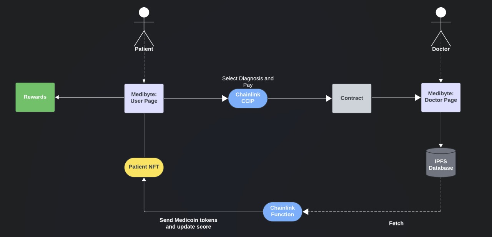

## Medibyte

Unlock your health potential with Medibyte - where health meets innovation. Revolutionize your well-being with Medibyte services. 🩺

Medibyte leverages the Blockchain Technology to reward users with on-chain tokens linked to unique dynamic NFTs. The project aims to incentivize healthy lifestyle choices by rewarding users with MediCoin tokens, based on off-chain health-related data.

Accessible to users globally, Medibyte streamlines data-intensive processes like searching and maintaining health records through its user-friendly interface. Experience it live here: [Medibyte Platform](https://test-client-mu.vercel.app/)

*You should be met with a homepage that looks like this:*

**The project consists of the following repository:**
https://github.com/TeamMaverick5/Medibyte

## Motivation behind the project

The motivation for Medibyte stems from a critical need in the healthcare industry: encouraging patients to actively engage in improving and maintaining their health. Typically, patients undergo medical tests and treatments without any immediate or tangible incentives to follow through on health recommendations or track their progress over time.
Medibyte aims to address this gap by leveraging blockchain technology to create a reward system that provides patients with health tokens based on their test results and health improvements. These tokens act as tangible incentives for patients to follow medical advice and make healthier lifestyle choices.

### The primary goals of Medibyte are:

1.**Incentivize Health Improvements**: By rewarding patients with tokens and dynamic NFTs that reflect their health progress, Medibyte motivates patients to stay engaged with their health management and strive for continuous improvement.

2.**Enhance Patient Engagement**: The reward system fosters a more interactive and engaging experience for patients, encouraging them to regularly participate in health check-ups and follow through on treatments.

3.**Strengthen Patient-Provider Relationships**: Healthcare providers can use Medibyte to build stronger relationships with their patients, enhancing patient loyalty and satisfaction through a system that recognizes and rewards their efforts.
*
Medibyte envisions a healthcare ecosystem where patients are more proactive about their health, leading to better health outcomes and a more efficient healthcare system overall.

## How It Works: Detailed Architecture

### Overview

Medibyte is a web3-based health incentive platform that integrates blockchain technology to reward patients for health improvements. The platform consists of several components: smart contracts, IPFS for data storage, Chainlink services, and a frontend built with modern web technologies. Here’s a detailed breakdown of the architecture and how each part works together:

### 1. Patient Selects Tests and Pays

#### Payment Options
- **On the Same Chain**: If the patient and doctor are on the same chain (e.g., Avalanche), the patient pays for the tests directly to the Health_Contract using USDC.
- **Cross-Chain via CCIP**: If the patient is on a different chain, they can still pay using USDC via Chainlink's Cross-Chain Interoperability Protocol (CCIP). This involves transferring data along with the tokens, where the data includes a function selector and its arguments.

#### Function: `selectTests`
- The patient calls the `selectTests` function in the `Health_Contract`, passing the selected tests and payment amount.
- The contract stores the test selections in a mapping and logs the patient's details.

### 2. Doctor Uploads Test Results

#### Data Storage on IPFS
- The doctor performs the tests and uploads the results to IPFS, ensuring the data is decentralized and securely stored.

#### Function: `updatePatientHealthScore`
- The doctor then calls `updatePatientHealthScore` in the `Health_Contract`. This function sends a request to Chainlink's Off-Chain Computation (Functions) to process the patient's data.
- The off-chain function retrieves the patient's data from IPFS, calculates the health score, determines the number of health tokens to be awarded, and updates the patient's NFT with a new URI reflecting the updated score.

### 3. Chainlink Off-Chain Computation

#### Data Processing
- Chainlink’s Off-Chain Computation fetches the patient's data from IPFS via an API.
- It calculates the patient's health score and the number of tokens to award based on the test results.
- It updates the patient’s NFT data, including generating a new URI.

#### Function Response
- The off-chain function returns three values to the `Health_Contract`: `tokensToProvide`, `newUri`, and `healthScore`.

### 4. Updating the Blockchain

#### Callback: `fulfillRequest`
- The `Health_Contract` receives the response through the `fulfillRequest` callback function.
- The contract uses Chainlink’s log-triggered automation to handle the function call due to gas limitations.

#### Function: `performUpkeep`
- This function is triggered automatically by Chainlink Automation once the response is logged.
- It mints a new NFT for the patient if they don't already have one or updates the existing NFT's URI with the new data.
- It mints health tokens to the patient's address based on their updated score.
- The USDC in the contract is transferred to the doctor.

### 5. Patient Profile and Rewards

#### Patient Profile
- Patients can view their NFTs on their profile page, displaying their health score and available tokens.
- The NFTs are dynamic, updating with each new test result and score.

#### Claiming Rewards
- Patients can claim reward NFTs like `HealthInsuranceNFT`, `FreeHealthKitNFT`, and `FreeHealthCheckupNFT` if they have enough health tokens.
- The claim process involves transferring the required tokens to the doctor and updating the patient’s NFT to reflect the new balance.

  

## Backend

### Smart Contracts
- **Solidity**: Programming language used to write smart contracts.
- **Avalanche Fuji Testnet**: Deployment environment for all smart contracts.
- **Sepolia Testnet**: Utilized for CCIP transactions.

### Chainlink Services
- **Cross-Chain Interoperability Protocol (CCIP)**: Used for cross-chain transactions, enabling users from different chains to interact with the Medibyte platform.
- **Off-Chain Computation**: Leveraged to process complex computations off-chain, such as calculating health scores based on patient data fetched from IPFS.
- **Chainlink Automation**: Employed for log-triggered automation, enabling efficient handling of function calls and responses.

### IPFS (InterPlanetary File System)
- **Decentralized Data Storage**: Test results and patient data are securely stored on IPFS, ensuring data integrity and accessibility.

### Find The Deployed Contracts Here:

- **FreeHealthCheckupNFT.sol**:0xAACE72Ea5C362a7865D5fce91283cA09711e1307
- **FreeHealthKitNFT.sol**:0x0aE3314a123A650439444a378440C5f5aE6E2495
- **HealthInsuranceNFT.sol**:0x7AB3b768CA87966Be8733bEc283f8bA81f85d119
- **Health_Contract.sol**:0xBB9B0b1D6B288c27FE6A5CD0973db141808e91a3
- **MediCoin.sol**:0xdeBC2C24cBDF8482bCDe2F926fDC13DA89B45815
- **PatientNFT.sol**:0x009bBEB7f05FdeCE2944b1273d4e99e029EFf9B0
- **Sender.sol**:0xc49996BaDDf99099143EDD2417e9A4B172233368
- **Receiver.sol**:0x381c0CFe1A6EF9C47C06495B87F3866eFC5247Ab

### Summary
The backend of Medibyte relies on a combination of smart contracts written in Solidity, Chainlink services for off-chain computations and automation, and IPFS for decentralized data storage. Smart contracts are deployed on Avalanche Fuji Testnet, with Sepolia Testnet utilized for CCIP transactions. This backend architecture ensures the reliability, security, and interoperability of the Medibyte platform.

## Frontend

### Technologies Used

#### Frameworks and Libraries
- **React.js**: JavaScript library for building user interfaces.
- **Tailwind CSS**: Utility-first CSS framework for styling.
- **React Parallax**: Used for adding parallax effects to enhance the user experience.

#### Build Tools
- **Vite**: Fast, modern build tool for frontend development.

#### HTTP Client
- **Axios**: JavaScript library for making HTTP requests.

### Summary
The frontend of Medibyte is built using modern web technologies to deliver an intuitive and engaging user experience. React.js is used for building dynamic UI components, while Tailwind CSS provides a sleek and responsive design. React Parallax adds immersive effects to enhance user interaction. Vite is employed as a fast build tool for efficient development workflows. Axios handles HTTP requests, enabling seamless communication with backend services. Together, these technologies create a visually appealing and user-friendly frontend for the Medibyte platform.
 

## Summary

Medibyte is a revolutionary health incentive platform that leverages blockchain technology to reward patients for their health improvements. Built on a foundation of smart contracts, decentralized data storage, and Chainlink services, Medibyte offers a transparent, secure, and interoperable solution for incentivizing better health outcomes.

### Key Features

- **Patient-Driven Testing**: Patients can select tests and pay using USDC, with options for both same-chain and cross-chain transactions.
- **Off-Chain Computation**: Complex health score calculations are performed off-chain using Chainlink's Off-Chain Computation service, ensuring efficiency and scalability.
- **Dynamic NFTs**: Patients receive dynamic NFTs that reflect their health score and available tokens, providing a visual representation of their progress.
- **Reward System**: Patients can claim reward NFTs for achieving certain health milestones, fostering motivation and engagement.
- **Seamless Integration**: Medibyte seamlessly integrates frontend and backend technologies, including React.js, Tailwind CSS, Vite, Axios, and Chainlink services, to deliver a smooth and immersive user experience.

### Next Steps
- **Expansion**: Medibyte plans to expand its services and reach more patients and healthcare providers.
- **Enhancements**: Continuous improvements and feature enhancements based on user feedback and technological advancements.
- **Community Engagement**: Building a vibrant community of users, developers, and stakeholders to contribute to the growth and evolution of the platform.

Medibyte is not just a healthcare solution; it's a catalyst for positive change, empowering individuals to take control of their health and well-being while fostering collaboration and innovation in the healthcare industry.

**Challenges we ran into**

During the development of Medibyte, we encountered several significant challenges, each requiring dedicated effort and problem-solving:

1. Integration of Offchain Computation: Implementing the offchain computation function posed a major challenge. Despite utilizing the function playground provided by Chainlink, integrating it with our health contract proved difficult. Resolving compatibility issues and ensuring seamless integration demanded extensive troubleshooting and consumed considerable time and effort.

2. Integration of CCIP: Integrating the Cross-Chain Interoperability Protocol (CCIP) presented another hurdle. This involved facilitating fee transfers between different blockchain networks and transmitting data alongside USDC payments. Overcoming the complexities of cross-chain transactions required meticulous planning and thorough testing to ensure smooth functionality.

3. Integration of Log Triggered Function: Implementing the log triggered function posed its own set of challenges. Initially, we attempted to incorporate the Upkeep function's code within the callback function _fulfillRequest_. However, due to limitations on gas consumption, this approach proved impractical. Subsequently, we transitioned to a log-based triggered function, which necessitated adjustments to our implementation strategy and codebase.

Navigating these challenges demanded perseverance, collaboration, and innovative problem-solving, ultimately contributing to the robustness and resilience of the Medibyte platform.

## Accomplishments

- Successful integration of beautiful frontend with backend, achieving seamless interaction and user experience.
- Overcoming challenges such as integrating off-chain computation and CCIP transactions, demonstrating resilience and problem-solving skills.
- Utilizing Chainlink's products effectively to enhance platform functionality and reliability.

**What we learnt**

## What We Learned

- **Connecting Frontend with Blockchain**: Gained expertise in integrating frontend technologies with blockchain smart contracts to create a cohesive user experience.
- **Writing Efficient Smart Contracts**: Developed proficiency in writing optimized and secure smart contracts using Solidity.
- **Utilizing Chainlink's Products**: Learned how to leverage Chainlink's services such as CCIP, off-chain computation, and automation to enhance platform functionality.
- **Integration of Contracts**: Mastered the integration of multiple smart contracts and external services to create a comprehensive platform architecture.
- **Teamwork**: Enhanced collaboration and communication skills through effective teamwork and problem-solving.

---
